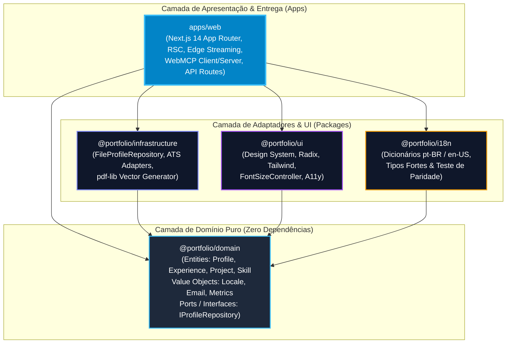
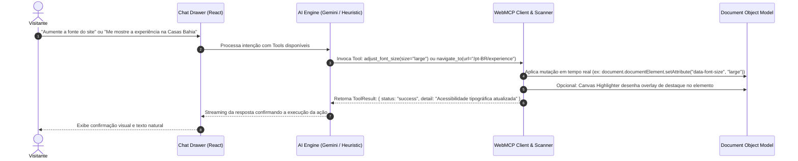

# 🏛️ Engineering Portfolio Platform — Architecture & Technical Decision Manifesto

> **Plataforma de Engenharia de Software de Alta Performance, Agente Autônomo WebMCP & Observatório de Telemetria RUM**  
> Desenvolvido por **Guilherme Rodovalho** — Arquiteto de Software & Staff Software Engineer.

[](https://www.typescriptlang.org/)
[](https://nextjs.org/)
[](https://blog.cleancoder.com/uncle-bob/2012/08/13/the-clean-architecture.html)
[](https://modelcontextprotocol.io/)
[](https://ai.google.dev/)
[](https://vitest.dev/)
[](https://resend.com/)

---

## 📑 Sumário Executivo

- [1. Visão do Produto & Posicionamento de Engenharia](#1-visão-do-produto--posicionamento-de-engenharia)
- [2. Visão Geral da Arquitetura](#2-visão-geral-da-arquitetura)
  - [2.1. Princípios Norteadores](#21-princípios-norteadores)
  - [2.2. Diagrama de Dependências de Camadas (Clean Architecture)](#22-diagrama-de-dependências-de-camadas-clean-architecture)
  - [2.3. Topologia do Monorepo (`pnpm workspaces`)](#23-topologia-do-monorepo-pnpm-workspaces)
- [3. Decisões Técnicas & Trade-offs Arquiteturais Detalhados](#3-decisões-técnicas--trade-offs-arquiteturais-detalhados)
  - [3.1. Modular Monolith vs. Micro-frontends](#31-modular-monolith-vs-micro-frontends)
  - [3.2. Next.js 14 App Router & React Server Components (RSC) vs. SPA Tradicional (CSR)](#32-nextjs-14-app-router--react-server-components-rsc-vs-spa-tradicional-csr)
  - [3.3. Arquitetura WebMCP (Model Context Protocol no Navegador)](#33-arquitetura-webmcp-model-context-protocol-no-navegador)
  - [3.4. Estratégia de Inteligência Artificial Tripla & Zero-Hallucination Guardrails](#34-estratégia-de-inteligência-artificial-tripla--zero-hallucination-guardrails)
  - [3.5. Observatório de Performance RUM (Real User Monitoring) & Zero-SDK Overhead](#35-observatório-de-performance-rum-real-user-monitoring--zero-sdk-overhead)
  - [3.6. Transacionalidade de E-mail com Resend (Edge & Serverless Ready)](#36-transacionalidade-de-e-mail-com-resend-edge--serverless-ready)
  - [3.7. Acessibilidade Dinâmica de Fontes (UI + WebMCP)](#37-acessibilidade-dinâmica-de-fontes-ui--webmcp)
  - [3.8. Geração Vetorial de Currículos ATS com `pdf-lib`](#38-geração-vetorial-de-currículos-ats-com-pdf-lib)
  - [3.9. Paridade Rigorosa de Internacionalização (100% Key Parity Testing)](#39-paridade-rigorosa-de-internacionalização-100-key-parity-testing)
- [4. Estrutura do Repositório & Mapa de Diretórios](#4-estrutura-do-repositório--mapa-de-diretórios)
- [5. Qualidade de Software, Testes & Garantias Automatizadas](#5-qualidade-de-software-testes--garantias-automatizadas)
- [6. Guia de Instalação & Execução Local](#6-guia-de-instalação--execução-local)
- [7. Licença e Autoria](#7-licença-e-autoria)

---

## 1. Visão do Produto & Posicionamento de Engenharia

Esta aplicação foi concebida sob uma premissa fundamental:

> **"O próprio portfólio deve demonstrar na prática a forma como eu penso, desenho, construo e otimizo sistemas de software em escala real."**

Em vez de um site estático comum construído com templates prontos, esta plataforma opera simultaneamente como:
1. **Engineering Case Study Vivo**: Implementa padrões arquiteturais corporativos (Clean Architecture, SOLID, Design Patterns, Streaming SSR).
2. **AI Career Platform**: Sistema autônomo com RAG determinístico baseado na carreira real de Guilherme Rodovalho.
3. **WebMCP Agent**: Servidor e cliente de *Model Context Protocol* executando no próprio navegador para inspeção semântica e orquestração do DOM.
4. **Performance & RUM Observatory**: Telemetria em tempo real das Web Vitals do visitante sem introduzir SDKs externos pesados.
5. **ATS Career Engine**: Pipeline de geração vetorial de currículos em PDF otimizados para sistemas de triagem automatizada (Workday, Lever, Greenhouse, Gupy).

### 👤 Sobre o Autor
**Guilherme Rodovalho** é Arquiteto de Software e Staff Software Engineer com vasta bagagem em ecossistemas de alta volumetria e missão crítica:
- **Casas Bahia**: Engenharia de Frontend e Arquitetura Web de altíssima escala; sustentação de picos de **150.000 requisições por minuto** na Black Friday; otimização de Core Web Vitals reduzindo o **LCP de 4.2s para 1.4s** com impacto direto em dezenas de milhões de reais em conversão.
- **Hotmart**: Engenharia de produtos globais e plataformas atendendo a mais de **35 milhões de usuários** em mais de 180 países.
- **Cielo & Zup Innovation / Itaú**: Arquitetura de micro-frontends bancários, sistemas antifraude e transações financeiras distribuídas com alta resiliência e SLAs de 99.99%.

---

## 2. Visão Geral da Arquitetura

A arquitetura do projeto segue os preceitos de **Clean Architecture (Onion Architecture)** combinados com o padrão **Modular Monolith** via `pnpm workspaces`. 

### 2.1. Princípios Norteadores
- **Independência de Frameworks**: O domínio de negócio não conhece React, Next.js ou bancos de dados.
- **Inversão de Dependência (DIP)**: Camadas externas dependem de abstrações (interfaces/portas) definidas no núcleo interno.
- **Tipagem Estrita Ponta a Ponta**: TypeScript em modo `strict` em todos os pacotes, eliminando `any` e suposições em tempo de execução.
- **Imutabilidade e Determinismo**: Entidades de domínio e Value Objects são imutáveis e auditados por testes unitários.

### 2.2. Diagrama de Dependências de Camadas (Clean Architecture)



### 2.3. Topologia do Monorepo (`pnpm workspaces`)

A segregação do código fonte garante que cada pacote possua fronteiras de isolamento estritas (*bounded contexts*):

| Pacote / App | Tipo | Responsabilidade Primária | Dependências Externas |
|---|---|---|---|
| `packages/domain` | **Domain Core** | Entidades de domínio, Value Objects, interfaces de repositório e contratos puros. | **0 dependências** (nem mesmo Node.js runtime). |
| `packages/infrastructure` | **Infrastructure** | Repositórios em arquivo JSON/Markdown, parsers de ATS, renderizador de PDF vetorial via `pdf-lib`. | `@portfolio/domain`, `pdf-lib`, `zod`. |
| `packages/i18n` | **Cross-cutting** | Mensagens e localizações completas (pt-BR e en-US), com tipagem rigorosa derivada dos schemas. | `@portfolio/domain`. |
| `packages/ui` | **Design System** | Componentes reutilizáveis sem dependência de framework de rota (Header, Footer, Timeline, Cards, FontSizeController). | `@portfolio/domain`, `@portfolio/i18n`, `lucide-react`, `clsx`, `tailwind-merge`. |
| `apps/web` | **Delivery App** | Next.js 14 App Router, Server Components, WebMCP Server/Client, Endpoints API (`/api/chat`, `/api/contact`), Observatório RUM. | Todos os pacotes locais + `next`, `react`, `@google/genai`, `resend`. |

---

## 3. Decisões Técnicas & Trade-offs Arquiteturais Detalhados

### 3.1. Modular Monolith vs. Micro-frontends

#### Contexto & Problema
Apresentar uma solução de nível corporativo requer decidir entre arquiteturas distribuídas (Micro-frontends) e arquiteturas consolidadas (Modular Monolith).

#### Decisão
**Adoção de Modular Monolith baseado em `pnpm workspaces` com TypeScript Project References.**

#### Racional Técnico & Trade-offs
```
┌───────────────────────────────────────┬────────────────────────────────────────┐
│            Micro-frontends            │            Modular Monolith            │
├───────────────────────────────────────┼────────────────────────────────────────┤
│ ❌ Sobrecarga operacional pesada       │ ✅ Deploy único e atômico              │
│ ❌ Risco de quebra de contratos runtime │ ✅ Typechecking estático ponta a ponta │
│ ❌ Fragmentação de estilos e CSS dup   │ ✅ Design system único e sem overhead  │
│ ❌ LCP/FCP penalizados por múltiplos JS│ ✅ Zero runtime cost de boundaries     │
└───────────────────────────────────────┴────────────────────────────────────────┘
```
- **Por que não Micro-frontends aqui?** Micro-frontends resolvem problemas de *organização de times independentes* em corporações com centenas de engenheiros, mas impõem um custo severo em latência de rede, duplicação de bundles de React e complexidade de orquestração.
- **Vantagem do Monólito Modular**: Fornece o mesmo nível de desacoplamento de código e fronteiras limpas que os micro-frontends oferecem, porém com a performance, simplicidade de deploy e garantia estática de tipos do monorepo.

---

### 3.2. Next.js 14 App Router & React Server Components (RSC) vs. SPA Tradicional (CSR)

#### Decisão
**Uso exclusivo de React Server Components (RSC) por padrão, limitando o uso de `"use client"` às folhas da árvore de componentes que exigem eventos de usuário ou hooks de navegador.**

#### Racional Técnico
1. **Redução Drástica do JavaScript no Wire**: O conteúdo textual, Markdown, schemas e o motor de domínio do currículo são executados e renderizados 100% no servidor. Nenhum parser de Markdown ou JSON pesado é despachado para o navegador do visitante.
2. **TTFB Sub-50ms via Edge Streaming**: Utilização de `Suspense` para transmitir chunks de HTML assim que ficam prontos, permitindo que a interface principal apareça instantaneamente enquanto blocos dinâmicos são hidratados sob demanda.
3. **Preservação de Rotas e Estado no Switch de Idioma**:
   O componente `AppHeader.tsx` e o `LanguageSwitcher.tsx` utilizam `usePathname()` para extrair e recompor o caminho exato atual:
   ```typescript
   // Exemplo: /pt-BR/experience ➔ /en-US/experience (sem resetar para root)
   const currentPath = pathname ? pathname.replace(/^\/[a-z]{2}-[A-Z]{2}/, "") : "";
   const targetHref = `/${targetLocale}${currentPath}`;
   ```
   Isso garante que visitantes técnicos e recrutadores internacionais alternem entre inglês e português sem perder o contexto da página em que estavam navegando.

---

### 3.3. Arquitetura WebMCP (Model Context Protocol no Navegador)

#### Contexto & Problema
Model Context Protocol (MCP) é tipicamente utilizado em backends (Node.js/Python) através de pipes STDIO ou SSE. Como permitir que um agente de inteligência artificial interaja dinamicamente com a página web do visitante em tempo real, navegando, rolando e acionando ações sem expor credenciais nem sobrecarregar o backend com requisições desnecessárias?

#### Decisão
**Engenharia de um subsistema WebMCP In-Browser pioneiro, combinando inspeção semântica do DOM, anotações declarativas e execução de ferramentas em memória no cliente.**



#### Ferramentas Registradas no WebMCP (`apps/web/src/lib/mcp/server.ts`):
- `navigate_to`: Navega programmaticamente para qualquer rota do portfólio.
- `scroll_to_section`: Rola suavemente até seções específicas (`#experience`, `#projects`, `#skills`).
- `highlight_element`: Cria um overlay visual temporário ao redor de um componente específico do DOM (ex: card de projeto ou métrica).
- `adjust_font_size`: Altera a escala tipográfica de toda a aplicação (`small`, `normal`, `large`) para fins de acessibilidade.
- `trigger_resume_download`: Aciona o download do currículo compilado em PDF na linguagem ativa.

---

### 3.4. Estratégia de Inteligência Artificial Tripla & Zero-Hallucination Guardrails

#### Contexto & Problema
Sistemas de chat baseados em LLMs frequentemente sofrem de alucinações (inventar empregos, tecnologias ou diplomas não existentes) ou falham quando o provedor externo enfrenta rate limits, indisponibilidade ou latência de rede.

#### Decisão
**Pipeline de Triplo Fallback Resiliente com RAG Determinístico Estrito.**

```
[Requisição do Usuário]
          │
          ▼
┌────────────────────────────────────────────────────────┐
│  Tier 1: Google Gemini 3.8 Flash (Cloud Streaming)     │
│  - Inferência ultra rápida no Edge                     │
│  - Suporte nativo a Tool Calling e streaming de tokens │
└───────────────────────┬────────────────────────────────┘
                        │ (Falha de cota, rede ou chave inválida)
                        ▼
┌────────────────────────────────────────────────────────┐
│  Tier 2: Gemini Nano (On-Device Client AI)             │
│  - Execução 100% local via Chrome window.ai            │
│  - Custo zero de inferência, privacidade total         │
└───────────────────────┬────────────────────────────────┘
                        │ (Navegador sem suporte a window.ai)
                        ▼
┌────────────────────────────────────────────────────────┐
│  Tier 3: Heuristic Pattern Engine (Motor Local Seguro) │
│  - Análise semântica determinística com Regex / Match  │
│  - Zero dependência externa, resposta imediata (<1ms)   │
└────────────────────────────────────────────────────────┘
```

#### Guardrails Anti-Alucinação (Grounding RAG):
1. O System Prompt injeta como *Ground Truth* exclusivo os dados estruturados de `packages/infrastructure/src/schemas/profile.json` e dos resumos profissionais bilíngues.
2. A IA possui instruções explícitas de engenharia de prompt para **recusar responder perguntas não relacionadas à carreira de Guilherme Rodovalho**, garantindo conformidade e seriedade de um portfólio profissional sênior.

---

### 3.5. Observatório de Performance RUM (Real User Monitoring) & Zero-SDK Overhead

#### Contexto & Problema
Monitorar a performance de uma aplicação web tipicamente envolve injetar scripts pesados de terceiros (Datadog RUM, New Relic, Hotjar, Google Analytics), que por si só degradam as pontuações de Core Web Vitals (aumentando TBT e atrasando LCP).

#### Decisão
**Desenvolvimento de um Observatório Nativo de Telemetria RUM (`/performance`), coletando métricas reais diretamente das APIs nativas do navegador sem adicionar nenhum byte de SDK externo.**

#### Métricas Capturadas e Exibidas:
- **Core Web Vitals**:
  - `TTFB` (Time to First Byte) via `PerformanceNavigationTiming.responseStart`.
  - `FCP` (First Contentful Paint) via `PerformancePaintTiming`.
  - `LCP` (Largest Contentful Paint) via `PerformanceObserver({ type: "largest-contentful-paint" })`.
  - `CLS` (Cumulative Layout Shift) com agregação de pontuações de layout shifts sem intervenção do usuário.
- **Hardware & Conectividade do Visitante**:
  - Detecção de núcleos lógicos de CPU via `navigator.hardwareConcurrency`.
  - Memória de dispositivo via `navigator.deviceMemory`.
  - Tipo de conexão e latência de rede (RTT, Downlink) via `navigator.connection` (Network Information API).
- **Micro-Benchmark em Tempo Real**:
  - Teste determinístico de stress de CPU in-browser (cálculo de 250.000 iterações com verificação de primos) para quantificar as operações por segundo que a máquina do visitante consegue processar.
- **Matriz de Engenharia Histórica**:
  - Quadro comparativo detalhado das otimizações reais realizadas na **Casas Bahia** (redução de 4.2s para 1.4s de LCP em 150k rpm) e **Hotmart** (+35M usuários).

---

### 3.6. Transacionalidade de E-mail com Resend (Edge & Serverless Ready)

#### Contexto & Problema
O envio tradicional de e-mails em Node.js com `nodemailer` depende de sockets TCP diretos para servidores SMTP (portas 25, 465 ou 587). Esse modelo é incompatível com ambientes de execução modernos baseados em **Vercel Edge Functions** ou **Cloudflare Workers**, que bloqueiam conexões TCP arbitrárias.

#### Decisão
**Integração com a API RESTful de alta velocidade do Resend (`apps/web/src/lib/email/resend-client.ts`).**

#### Benefícios:
- Comunicação 100% via chamadas HTTP/2 criptografadas com TLS.
- Funciona perfeitamente em Serverless, Node.js tradicional ou Edge Runtime.
- Auditoria instantânea de entrega através do identificador único retornado pela API (`resendData.data.id`).
- Formatação rica e elegante de mensagens em HTML com visual escuro condizente com a identidade visual da plataforma.

---

### 3.7. Acessibilidade Dinâmica de Fontes (UI + WebMCP)

#### Contexto & Decisão
Para atender às diretrizes de acessibilidade WCAG (Web Content Accessibility Guidelines) sem quebrar o layout nem depender de zoom destrutivo do navegador, foi construído um sistema de escala tipográfica em 3 níveis:
- `small` (93.75% / 15px base)
- `normal` (100% / 16px base)
- `large` (112.5% / 18px base)

#### Implementação Elegante:
1. Uma única variável CSS global no elemento raiz:
   ```css
   html[data-font-size="small"] { font-size: 15px; }
   html[data-font-size="normal"] { font-size: 16px; }
   html[data-font-size="large"] { font-size: 18px; }
   ```
2. Como todos os componentes utilizam unidades `rem` do Tailwind CSS, a aplicação inteira escala harmonicamente e instantaneamente sem recálculos pesados de layout.
3. **Controle Híbrido**: O visitante pode clicar nos seletores do cabeçalho (`A-`, `A`, `A+`) ou simplesmente pedir no chat da IA: *"pode aumentar a letra pra mim?"*, que aciona a ferramenta WebMCP de alteração de fonte.

---

### 3.8. Geração Vetorial de Currículos ATS com `pdf-lib`

#### Contexto & Problema
Muitas aplicações geram PDFs utilizando instâncias headless do Chromium (ex: Puppeteer ou Playwright). Em ambientes de produção e nuvem, rodar Chromium acarreta:
- Download de binários pesados de centenas de megabytes.
- Consumo de mais de 500MB de memória RAM por renderização.
- Risco de travamentos sob concorrência e alta latência (>2 segundos por PDF).

#### Decisão
**Geração programática pura de PDFs vetoriais através da biblioteca `pdf-lib` (`scripts/generate-resumes.mjs` e `packages/infrastructure`).**

#### Resultados:
- **Consumo de memória desprezível** (< 15MB de heap).
- **Tempo de geração inferior a 80ms**.
- **Tipografia vetorial perfeita**: O texto não é rasterizado em imagens; é desenhado como texto vetorial nativo selecionável, permitindo **100% de precisão de leitura em parsers de ATS corporativos** (Applicant Tracking Systems).

---

### 3.9. Paridade Rigorosa de Internacionalização (100% Key Parity Testing)

#### Contexto & Problema
Em aplicações multilíngues, é comum que novas funcionalidades sejam adicionadas em um idioma e esquecidas em outro, gerando telas com chaves vazias ou erros de renderização (`undefined`) para usuários estrangeiros.

#### Decisão
**Criação de um teste unitário automatizado de paridade de chaves (`packages/i18n/__tests__/parity.test.ts`).**
O teste inspeciona recursivamente todas as chaves do dicionário em `pt-BR` e `en-US` e falha imediatamente o build se houver qualquer divergência ou chave ausente:
```
✓ packages/i18n/__tests__/parity.test.ts
  ✅ i18n Parity Check PASSED: 107 keys validated across all locales.
```

---

## 4. Estrutura do Repositório & Mapa de Diretórios

```
portifolio/
├── apps/
│   └── web/                               # Aplicação principal Next.js 14 App Router
│       ├── src/
│       │   ├── app/
│       │   │   ├── [lang]/                # Rotas internacionalizadas (/pt-BR e /en-US)
│       │   │   │   ├── about/             # Trajetória, biografia e propósito
│       │   │   │   ├── career/            # Linha do tempo de carreira e cases
│       │   │   │   ├── contact/           # Formulário de contato com envio Resend
│       │   │   │   ├── experience/        # Experiências detalhadas com métricas
│       │   │   │   ├── performance/       # Observatório de performance RUM e Web Vitals
│       │   │   │   ├── projects/          # Showcase de projetos e arquitetura
│       │   │   │   ├── resume/            # Visualizador e download de currículo ATS
│       │   │   │   ├── skills/            # Matriz de competências técnicas e soft skills
│       │   │   │   ├── layout.tsx         # Layout raiz com injeção de fontes e cabeçalho
│       │   │   │   └── page.tsx           # Landing page de alto impacto
│       │   │   ├── api/                   # API Routes Serverless
│       │   │   │   ├── chat/              # Endpoint de IA com streaming e WebMCP Tools
│       │   │   │   ├── contact/           # Envio transacional de e-mail via Resend
│       │   │   │   ├── job-application/   # Engine de análise de vagas e fit cultural
│       │   │   │   └── resume/            # Download do PDF vetorial bilíngue
│       │   │   └── globals.css            # Design tokens, reset e controle de fonte
│       │   ├── components/                # Componentes específicos de aplicação
│       │   │   ├── ai/                    # Drawer de chat, interface do assistente
│       │   │   ├── auto-apply/            # Modais de candidatura e análise de vagas
│       │   │   └── performance/           # Widgets de gráficos e métricas RUM
│       │   └── lib/                       # Motores de negócio e integrações
│       │       ├── ai/                    # Clientes Gemini 3.8 Flash, Nano e Heurístico
│       │       ├── auto-apply/            # Adaptadores de ATS (Workday, Lever, Gupy)
│       │       ├── email/                 # Cliente Resend tipado e templates HTML
│       │       └── mcp/                   # Servidor e cliente WebMCP in-browser
├── content/                               # Base de conhecimento e conteúdo bruto
│   ├── profile.json                       # Dados canônicos do perfil e experiências
│   ├── resume-en.txt                      # Conteúdo do currículo em Inglês
│   └── resume-pt.txt                      # Conteúdo do currículo em Português
├── packages/
│   ├── domain/                            # Camada de Domínio Puro (Zero Dependências)
│   │   └── src/
│   │       ├── entities/                  # Profile, Experience, Project, Skill
│   │       ├── errors/                    # Erros customizados de domínio
│   │       ├── ports/                     # Interfaces de Repositórios e Serviços
│   │       └── values/                    # Value Objects (Locale, Email, Metrics)
│   ├── infrastructure/                    # Adaptadores Concretos e Infraestrutura
│   │   └── src/
│   │       ├── repositories/              # FileProfileRepository
│   │       └── schemas/                   # Schemas Zod e tipagens estruturadas
│   ├── i18n/                              # Internacionalização Rigorosa
│   │   └── src/
│   │       ├── messages/                  # Dicionários pt-BR.ts e en-US.ts
│   │       ├── types.ts                   # Schema TypeScript unificado
│   │       └── index.ts                   # Utilitários de busca de tradução
│   └── ui/                                # Design System Agnóstico de Framework
│       └── src/
│           ├── components/                # Header, Footer, Timeline, Buttons, Cards
│           │   └── FontSizeController.tsx # Controle de acessibilidade de fontes
│           └── utils/                     # Merge de classes Tailwind (cn helper)
├── scripts/
│   └── generate-resumes.mjs               # Gerador vetorial de currículos em PDF
├── package.json                           # Configuração do Workspace raiz
├── pnpm-workspace.yaml                    # Definição dos pacotes do monorepo
└── vitest.config.ts                       # Configuração global da suíte de testes
```

---

## 5. Qualidade de Software, Testes & Garantias Automatizadas

A plataforma conta com uma rigorosa suíte de testes e rotinas de validação de qualidade:

### 1. Suíte de Testes Automatizados com Vitest
Todos os testes rodam em milissegundos com feedback contínuo:
```bash
pnpm test
```
**Resultado da Execução:**
```
✓ apps/web/src/lib/mcp/__tests__/mcp.test.ts (10 tests)
  - Registro de ferramentas WebMCP
  - Execução segura de navegação, scroll e manipulação de fontes
  - Validação de schemas com Zod

✓ apps/web/src/lib/auto-apply/__tests__/auto-apply.test.ts (11 tests)
  - Extração semântica de requisitos de vagas
  - Cálculo de pontuação de fit profissional
  - Geração estruturada de cover letters

✓ packages/infrastructure/__tests__/file-profile-repository.test.ts (5 tests)
  - Carregamento e mapeamento correto do perfil a partir de arquivo
  - Integridade dos dados de experiência corporativa

✓ packages/domain/__tests__/profile.test.ts (4 tests)
  - Criação e invariantes das entidades de domínio
  - Métodos utilitários de cálculo de tempo de carreira

✓ packages/i18n/__tests__/parity.test.ts (3 tests)
  - Validação de 100% de paridade entre pt-BR e en-US (107 chaves idênticas)

Test Files  5 passed (5)
     Tests  33 passed (33)
  Duration  1.32s
```

### 2. Validação Rigorosa de Tipos TypeScript
Todos os 5 pacotes do workspace são validados recursivamente em modo estrito:
```bash
pnpm typecheck
```
Garantia de **0 erros de compilação** e tipagem estrita de ponta a ponta.

---

## 6. Guia de Instalação & Execução Local

### Pré-requisitos
- **Node.js**: `>= 20.0.0`
- **Package Manager**: `pnpm >= 9.0.0`

### 1. Clonar o Repositório
```bash
git clone https://github.com/rodovalhog/portifolio.git
cd portifolio
```

### 2. Instalar Dependências
```bash
pnpm install
```

### 3. Configurar Variáveis de Ambiente
Crie o arquivo `apps/web/.env.local` a partir do template de exemplo:
```bash
cp .env.example apps/web/.env.local
```
Preencha suas credenciais:
```ini
# Google Gemini API Key (para o assistente de IA na nuvem)
GEMINI_API_KEY=sua_chave_gemini_aqui

# Resend API Key (para envio do formulário de contato)
RESEND_API_KEY=sua_chave_resend_aqui
```
*(Nota: Caso nenhuma chave seja configurada, o sistema acionará automaticamente os modos de fallback heurístico e simulação segura, mantendo todas as funcionalidades ativas).*

### 4. Gerar os PDFs dos Currículos
Gere os currículos bilíngues vetoriais:
```bash
node scripts/generate-resumes.mjs
```

### 5. Executar em Modo de Desenvolvimento
```bash
pnpm dev
```
Acesse a aplicação no navegador em [http://localhost:3000](http://localhost:3000).

### 6. Executar Build de Produção
Para validar a compilação completa com pré-renderização estática de rotas:
```bash
pnpm build
```

---

## 7. Licença e Autoria

Distribuído sob a licença MIT. Consulte `LICENSE` para mais informações.

Desenvolvido com excelência técnica por **[Guilherme Rodovalho](https://www.linkedin.com/in/rodovalho/)**.
- **Email**: [rodovalhogdeveloper@gmail.com](mailto:rodovalhogdeveloper@gmail.com)
- **LinkedIn**: [linkedin.com/in/rodovalho](https://www.linkedin.com/in/rodovalho/)
- **GitHub**: [github.com/rodovalhog](https://github.com/rodovalhog)
